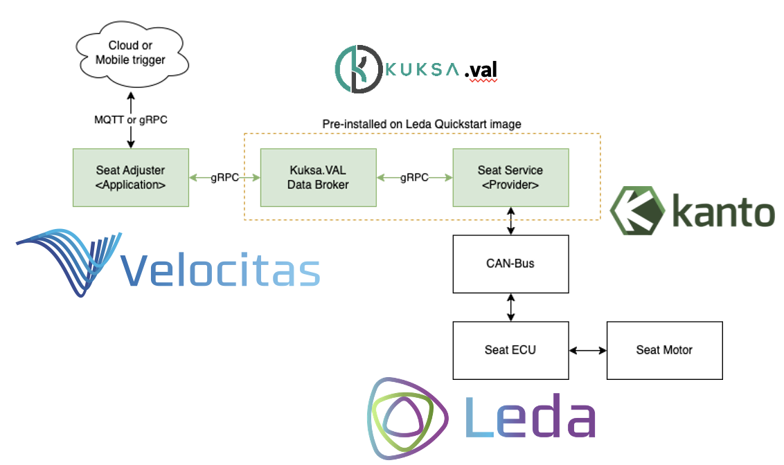

# 🚘 Develop your Eclipse Velocitas vehicle application 🚘

## ℹ️ Introduction

In this hack challenge, you develop your Vehicle Application using [Eclipse Velocitas](https://eclipse.dev/velocitas/). You start by setting up a __Seat Adjuster__ example and then extend it with _individual ideas_. For instance, you may allow the delivery of packages to your trunk, or create individualized welcome sequences when the driver approaches the vehicle.

The Seat Adjuster showcases how to create a Vehicle Application that senses and actuates signals in a vehicle through Eclipse Kuksa and the Vehicle Signal Specification (VSS). It runs on Eclipse Leda, and we use Eclipse Velocitas for the development.

## 🖥️ Need to know

We intend this hack challenge for people who are new to the concepts of the technologies mentioned before. Because of that, we do not assume prior knowledge, but some experience with running Docker containers is helpful.

## 🍦 Creative challenge

- Create custom, individual, user-friendly scenario or use-case based on available combination of VSS signals

## 🍨 Technical challenge

- Create a Vehicle Application based on your use-case or scenario

## 🧑‍🤝‍🧑 Hack-Coaches

- [Sven Erik Jeroschewski](https://github.com/eriksven)
- [Markus Petke](https://github.com/MP91)
- [Lukas Mittag](https://github.com/lukasmittag)
- [Serhii Korchynskyi](https://github.com/kse3hi)

## ❗❗❗ How to start?

To set up the template, follow the explanation for the [Seat Adjuster in Eclipse Leda](https://eclipse-leda.github.io/leda/docs/app-deployment/seat-adjuster/). In the end, you should have a copy of the Eclipse Velocitas Template repository with the seat adjuster example where you can start to develop your application.
The seat adjuster evolves around setting the signal: `Vehicle.Cabin.Seat.Row1.Pos1.Position` from the Vehicle Signal Specification (VSS). To develop other applications, you, therefore, need to find the matching signal. The [signal catalog of digital.auto](https://digitalauto.netlify.app/model/STLWzk1WyqVVLbfymb4f/cvi/list) is  helpful here. You can also use this catalog to ideate on further applications.

## 📚 Additional necessary resources

- Seat Adjuster documentation: https://eclipse-leda.github.io/leda/docs/app-deployment/seat-adjuster/

- Introduction to the underlying concept for SDV: https://eclipse-leda.github.io/leda/docs/general-usage/sdv-introduction/

- Eclipse Velocitas Template Repository: https://github.com/eclipse-velocitas/vehicle-app-python-template

- Vehicle Signal Specification: https://covesa.github.io/vehicle_signal_specification/introduction/overview/
